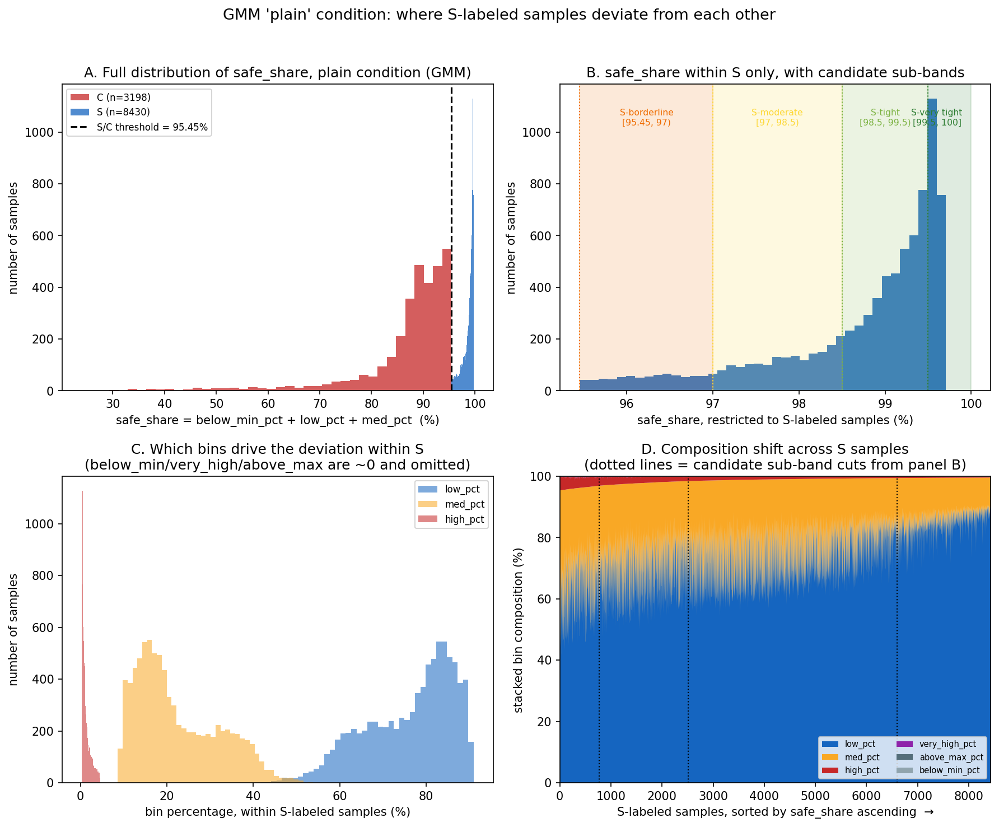
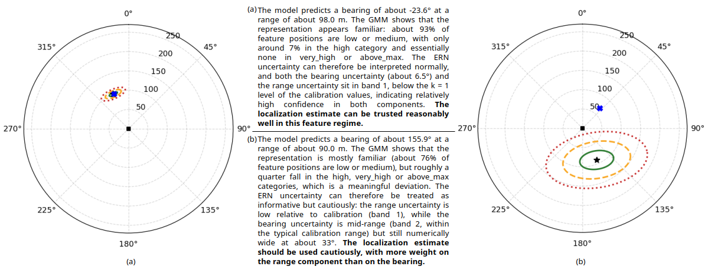

# Acoustic drone localization: prediction, uncertainty, and reliability

Predictions, uncertainty estimates, code, and qualitative results for an acoustic drone
localization system (bearing and range from an 8-microphone array). Two uncertainty sources
are evaluated together:

- **ERN**: the evidential localization model (`model_code/evidential_model.py`, Conformer
  encoder in `model_code/conformer_model.py`). Three Normal-Inverse-Gamma heads predict
  `sin(bearing)`, `cos(bearing)` and `range`, each with `(mu, v, alpha, beta)`, from which
  aleatoric, epistemic and total variance and a per-head standard deviation are derived.
- **GMM**: a Gaussian-mixture reliability check on the model's internal feature space. For each
  sample it reports how the 507,904 spatial positions of the feature map fall into six bands
  calibrated on a held-out calibration set (`below_min`, `low`, `med`, `high`, `very_high`, `above_max`).

The data covers 8 test conditions: `plain` (clean), `awgn_{-5,5,15}dB`, `clutter_{-5,5,15}dB`
(11,628 samples each, with ground truth) and `random_noise` (1,500 samples, **no ground truth**).

<!-- TODO: expand the "ERN" acronym here if desired -->

## Repository structure

```
.
├── README.md
├── requirements.txt
├── data/                          model outputs, ground-truth free
│   ├── predictions/<cond>.json        raw ERN outputs (mu, v, alpha, beta, sigmas, predicted bearing/range)
│   ├── ern_uncertainty/<cond>.json    ERN variances, sigmas and band codes 0-5
│   ├── gmm_bands/<cond>.json          GMM band counts and percentages per sample
│   └── summaries/                     small dataset-level CSVs (incl. calibration quantiles)
├── ground_truth/<cond>.json       true bearing/range + per-sample errors (7 conditions; none for random_noise)
├── analysis/
│   ├── data_io.py                     loaders + the S/C labeling rules
│   ├── build_tables.py                -> analysis/tables/table_A_*.csv, table_B_*.csv
│   ├── plot_all_groups.py             -> figures/test_set/ (140 plots, with ground truth)
│   ├── gmm_s_distribution.py          -> figures/gmm_plain_S_distribution.png
│   └── tables/
├── figures/
│   ├── test_set/<cond>/<category>/<pick>_<ID>.png    polar plots WITH ground truth
│   ├── gmm_plain_S_distribution.png
│   └── sample_44189_polar_coverage.png                calibration-set example
├── qualitative_examples/          hand-picked examples, their raw data dumps, paper figure, prompt guide
├── llm_interpretation/            ground-truth-free per-sample JSON + prompt for LLM interpretation
│   ├── prompt/LLM_prompt_guide.txt
│   ├── samples/<cond>/<category>/<pick>_<ID>.json    (140 files)
│   └── generate_llm_json.py
├── polar_plot_tool/               standalone plotting: with ground truth, and blind
│   ├── plot_prediction_vs_gt.py
│   └── plot_blind.py
├── model_code/                    training / inference / GMM / conformal-band pipeline
└── tools/convert_csv_to_json.py   how the JSON here was produced from the original CSV exports
```

**Labels.** Samples are labeled **S = Safe** or **C = Critical**, in the tables, plots, folder names (`ERN_S`, `JOINT_S-C`) and JSON fields (`"category": "ERN_S"`) alike. In a joint label the first letter is ERN and the second is GMM, so `S/C` means ERN Safe and GMM Critical (folders use `-` instead of `/`).

`ground_truth/` is deliberately separate: everything under `data/` and `llm_interpretation/`
can be inspected without seeing the answer, and `ground_truth/` is the single place the true
values live. (`figures/` and `qualitative_examples/` do show ground truth.)

## Data formats

Every file under `data/` and `ground_truth/` is a JSON array with one object per sample.
Sample `ID` is a string; it is zero-padded in `data/predictions` and `data/gmm_bands`
(`"00012015"`) but not in `data/ern_uncertainty` and `ground_truth` (`"12015"`). Compare
with `int(ID)`. `random_noise` IDs look like `"rand_00000000"`.

| file | main fields |
|---|---|
| `data/predictions/<cond>.json` | `sin_mu, cos_mu, range_mu`; NIG params `sin_v, sin_alpha, sin_beta` (same for `cos_`, `range_`); `aleatoric_var_*, epistemic_var_*, total_var_*, sigma_*` for sin/cos/range; `bearing_deg_pred, range_m_pred, bearing_std_deg` |
| `data/ern_uncertainty/<cond>.json` | the variances/sigmas above plus `*_band` codes (0-5), and `bearing_std_deg(_band)` |
| `data/gmm_bands/<cond>.json` | `below_min/low/med/high/very_high/above_max` as `_count` and `_pct` over `num_positions` (507,904), plus `ood_pct` |
| `ground_truth/<cond>.json` | `bearing_deg_gt, range_m_gt, bearing_error_deg, range_error_m, euclidean_error_m` |

Conventions:

- `range_mu` and every `*_range` variance/sigma are normalized: `range_m_pred = range_mu * 250`
  (exact across the calibration set), so `sigma_range * 250` is in meters.
- `sigma_h = sqrt(beta_h * (1 + v_h) / (v_h * (alpha_h - 1)))` (verified against the raw NIG
  parameters); `total_var = aleatoric_var + epistemic_var = sigma^2`. In GUM (JCGM 100:2008) terms `sigma` is a standard
  uncertainty, the root-sum-of-squares combination of the aleatoric and epistemic components.
- `bearing_deg_pred = atan2(sin_mu, cos_mu)`. `sin_mu` and `cos_mu` are independent regressions and
  are not constrained to the unit circle.
- Band codes: `0=below_min, 1=low, 2=med, 3=high, 4=very_high, 5=above_max`. Their edges are the
  min / 68.27% / 95.45% / 99.73% quantiles / max of each quantity on the clean calibration set
  (2,912 samples): `data/summaries/calibration/plain_calibration_set_uncertainty_quantiles.csv`. In GUM terms the
  edges sit at the coverage probabilities of coverage factors k = 1, 2, 3 for a normal distribution
  (68.27%, 95.45%, 99.73%). They are percentiles of the calibration uncertainty values, so a band says how large
  a sample's uncertainty is relative to calibration; it is not an expanded uncertainty of the location.
- Angles are in degrees; polar plots put 0° at the top with bearing increasing clockwise.

## Definitions used in the tables

- **ERN label**: **C** (Critical) if any of `sigma_sin_band`, `sigma_cos_band`, `sigma_range_band` is 3 or higher
  (`high`, `very_high`, `above_max`), otherwise **S** (Safe).
- **GMM label**: **S** (Safe) if `below_min_pct + low_pct + med_pct >= 95.45`, otherwise **C** (Critical).
  95.45% is the calibration edge of the `med` band. It holds *pooled over all positions of all
  samples* (95.4% of all `plain` positions fall in these three bands), not per sample, so
  individual clean samples can and do fall below it.
- **Joint label** `X/Y`: ERN label / GMM label.
- **Coverage at kσ** (k = 1, 2, 3, the GUM coverage factor; cumulative): a sample is covered only if all three hold:
  `|sin_mu - sin(bearing_gt)| <= k*sigma_sin`, `|cos_mu - cos(bearing_gt)| <= k*sigma_cos`,
  `|range_mu - range_gt/250| <= k*sigma_range`. A perfectly calibrated Gaussian would give
  68.3 / 95.4 / 99.7 %.
- **Euclidean error** (`euclidean_error_m`, precomputed) is the straight-line distance between
  predicted `(range_m_pred*sin_mu, range_m_pred*cos_mu)` and true
  `(range_m_gt*sin(bearing_gt), range_m_gt*cos(bearing_gt))`. It uses the raw, unnormalized
  `sin_mu`/`cos_mu`, so it also reflects how far those are from the unit circle and is not exactly
  reconstructible from `bearing_error_deg` and `range_error_m`.

## Results

Reproduce with `python analysis/build_tables.py`.

### Table A: share of samples labeled S (Safe) or C (Critical) (%)

| Condition | n | ERN S / C | GMM S / C | ERN+GMM S/S | S/C | C/S | C/C |
|---|--:|---|---|--:|--:|--:|--:|
| `plain` | 11628 | 91.0 / 9.0 | 72.5 / 27.5 | 66.7 | 24.3 | 5.8 | 3.2 |
| `awgn_-5dB` | 11628 | 100.0 / 0.0 | 0.0 / 100.0 | 0.0 | 100.0 | 0.0 | 0.0 |
| `awgn_5dB` | 11628 | 100.0 / 0.0 | 0.0 / 100.0 | 0.0 | 100.0 | 0.0 | 0.0 |
| `awgn_15dB` | 11628 | 100.0 / 0.0 | 0.0 / 100.0 | 0.0 | 100.0 | 0.0 | 0.0 |
| `clutter_-5dB` | 11628 | 100.0 / 0.0 | 0.0 / 100.0 | 0.0 | 100.0 | 0.0 | 0.0 |
| `clutter_5dB` | 11628 | 100.0 / 0.0 | 0.0 / 100.0 | 0.0 | 100.0 | 0.0 | 0.0 |
| `clutter_15dB` | 11628 | 99.8 / 0.2 | 0.0 / 100.0 | 0.0 | 99.8 | 0.0 | 0.2 |
| `random_noise` | 1500 | 100.0 / 0.0 | 0.0 / 100.0 | 0.0 | 100.0 | 0.0 | 0.0 |

### Table B: Euclidean error and coverage per group (conditions with ground truth)

Empty groups are omitted. Groups overlap (a sample is in one ERN group, one GMM group, and one
joint group). Coverage is the cumulative percentage of samples covered at kσ.

| Condition | Group | n | Euclid. MAE (m) | Cov. 1σ (%) | Cov. 2σ (%) | Cov. 3σ (%) |
|---|---|--:|--:|--:|--:|--:|
| `plain` | ERN S | 10581 | 13.6 | 55.2 | 91.4 | 97.8 |
| `plain` | ERN C | 1047 | 61.5 | 72.3 | 96.8 | 99.1 |
| `plain` | GMM S | 8430 | 15.5 | 55.8 | 91.3 | 98.0 |
| `plain` | GMM C | 3198 | 24.3 | 59.2 | 93.4 | 97.7 |
| `plain` | ERN+GMM S/S | 7759 | 12.2 | 54.4 | 90.8 | 97.9 |
| `plain` | ERN+GMM S/C | 2822 | 17.4 | 57.3 | 93.1 | 97.5 |
| `plain` | ERN+GMM C/S | 671 | 53.5 | 71.7 | 97.3 | 99.3 |
| `plain` | ERN+GMM C/C | 376 | 75.7 | 73.4 | 95.7 | 98.9 |
| `awgn_-5dB` | ERN S | 11628 | 96.2 | 0.0 | 0.1 | 0.5 |
| `awgn_-5dB` | GMM C | 11628 | 96.2 | 0.0 | 0.1 | 0.5 |
| `awgn_-5dB` | ERN+GMM S/C | 11628 | 96.2 | 0.0 | 0.1 | 0.5 |
| `awgn_5dB` | ERN S | 11628 | 88.3 | 0.0 | 0.8 | 3.1 |
| `awgn_5dB` | GMM C | 11628 | 88.3 | 0.0 | 0.8 | 3.1 |
| `awgn_5dB` | ERN+GMM S/C | 11628 | 88.3 | 0.0 | 0.8 | 3.1 |
| `awgn_15dB` | ERN S | 11628 | 81.0 | 0.2 | 2.0 | 6.5 |
| `awgn_15dB` | GMM C | 11628 | 81.0 | 0.2 | 2.0 | 6.5 |
| `awgn_15dB` | ERN+GMM S/C | 11628 | 81.0 | 0.2 | 2.0 | 6.5 |
| `clutter_-5dB` | ERN S | 11628 | 91.8 | 0.5 | 2.7 | 8.1 |
| `clutter_-5dB` | GMM C | 11628 | 91.8 | 0.5 | 2.7 | 8.1 |
| `clutter_-5dB` | ERN+GMM S/C | 11628 | 91.8 | 0.5 | 2.7 | 8.1 |
| `clutter_5dB` | ERN S | 11628 | 83.3 | 0.8 | 5.9 | 17.4 |
| `clutter_5dB` | GMM C | 11628 | 83.3 | 0.8 | 5.9 | 17.4 |
| `clutter_5dB` | ERN+GMM S/C | 11628 | 83.3 | 0.8 | 5.9 | 17.4 |
| `clutter_15dB` | ERN S | 11606 | 67.5 | 2.4 | 12.1 | 24.8 |
| `clutter_15dB` | ERN C | 22 | 38.0 | 13.6 | 50.0 | 68.2 |
| `clutter_15dB` | GMM C | 11628 | 67.5 | 2.5 | 12.1 | 24.9 |
| `clutter_15dB` | ERN+GMM S/C | 11606 | 67.5 | 2.4 | 12.1 | 24.8 |
| `clutter_15dB` | ERN+GMM C/C | 22 | 38.0 | 13.6 | 50.0 | 68.2 |

### What the tables show

- **Clean data (`plain`)**: ERN flags 9.0% of samples C and GMM flags 27.5%.
  ERN-S coverage is 55.2 / 91.4 / 97.8 % at 1/2/3σ
  (Euclidean MAE 13.6 m), a little below the Gaussian ideal; ERN-C samples have much larger
  error (MAE 61.5 m) but higher coverage, because their σ is wider.
- **Corrupted data**: GMM labels essentially every sample C (its feature-space check reacts to
  the noise), whereas ERN still labels essentially every sample S (only 22 of 11,628 `clutter_15dB`
  samples are ERN-C). Coverage collapses (e.g. `awgn_-5dB`: 0.0 / 0.1 / 0.5 %
  at MAE 96.2 m; `clutter_15dB` ERN-S: 2.4 / 12.1 / 24.8 %). The ERN's own σ does
  not grow with the corruption while its error does, which is why the GMM reliability check is
  used alongside it.
- **Why 27.5% of clean samples are GMM-C**: the 95.45% edge is a pooled guarantee (summed over
  every position of every `plain` sample the low+med share is 95.41%), but per-sample shares vary
  widely (min 24%, p10 87.8%, median 98.6%, max 99.7%). See `figures/gmm_plain_S_distribution.png`.



## Qualitative results

Each polar plot shows the prediction (star), 1σ/2σ/3σ ellipses (Monte-Carlo, anchored on the
prediction; see `polar_plot_tool/README.md`), the ground truth (blue X) and the microphone array
(square at the origin), on a 0-250 m axis.



*(a) `plain`, ID 381: predicted -23.6°, 98.0 m; GMM shows a largely familiar feature regime (93.1%
of positions low/med, just under the 95.45% cutoff, so the tables label it GMM-C) and ERN
reports low uncertainty. (b) `clutter_15dB`, ID 24123: predicted 155.9°, 90.0 m; about 24% of GMM
positions are high/very_high/above_max, so the ERN outputs should be read with caution.*

| example | polar plot (with ground truth) | blind input JSON | raw data dump |
|---|---|---|---|
| `plain` #381 | [median_381.png](figures/test_set/plain/JOINT_S-C/median_381.png) | [json](llm_interpretation/samples/plain/JOINT_S-C/median_381.json) | [txt](qualitative_examples/plain_median_381_results.txt) |
| `clutter_15dB` #24123 | [median_24123.png](figures/test_set/clutter_15dB/JOINT_S-C/median_24123.png) | [json](llm_interpretation/samples/clutter_15dB/JOINT_S-C/median_24123.json) | [txt](qualitative_examples/clutter_15dB_median_24123_results.txt) |
| `clutter_-5dB` #36602 | [low_36602.png](figures/test_set/clutter_m5dB/JOINT_S-C/low_36602.png) | [json](llm_interpretation/samples/clutter_m5dB/JOINT_S-C/low_36602.json) | [txt](qualitative_examples/clutter_m5dB_36602_results.txt) |

`figures/test_set/` holds 140 such plots: for each condition and category (`ERN_S`/`ERN_C`,
`GMM_S`/`GMM_C`, `JOINT_*`), the samples at the low / p25 / median / p75 / high percentiles of predicted
uncertainty (ranked by `bearing_std_deg`, then `sigma_range`). Categories that are empty for a
condition (e.g. `GMM_S` under noise) have no plots.

## LLM interpretation

`llm_interpretation/` contains the same 140 samples as ground-truth-free JSON (prediction,
GMM bands, ERN uncertainty; no ground truth or error fields) and the instruction prompt
`llm_interpretation/prompt/LLM_prompt_guide.txt`, which asks for a 2-4 sentence trust
assessment without reference to correctness. Fill the prompt's placeholders from a sample's
JSON (`ern_prediction`, `gmm`, `ern_uncertainty`). The band mapping (0-5) is already written into the prompt.

To see what the model saw, plot any sample without ground truth:
`python polar_plot_tool/plot_blind.py --json llm_interpretation/samples/plain/JOINT_S-C/median_381.json`

### Generated interpretations

Each example below shows the model input first, then the outputs of four LLMs in the order Gemini, Grok, ChatGPT, Claude. The input is the sample's ground-truth-free JSON (`gmm`, `ern_uncertainty`, `ern_prediction`), given to Gemini, Grok and ChatGPT as shown; Claude received the same values (rounded) inserted into the input template of the prompt. Outputs are reproduced verbatim. Prompt: `llm_interpretation/prompt/LLM_prompt_guide.txt`.

#### Example 1: `clutter_-5dB` #36602

Input ([`llm_interpretation/samples/clutter_m5dB/JOINT_S-C/low_36602.json`](llm_interpretation/samples/clutter_m5dB/JOINT_S-C/low_36602.json), fields shown to the models):

```json
{
  "gmm": {
    "below_min_pct": 0.0011813256048387097,
    "low_pct": 3.1118085307459675,
    "med_pct": 10.275366998487904,
    "high_pct": 27.539259387600808,
    "very_high_pct": 18.259749873991936,
    "above_max_pct": 40.81263388356855
  },
  "ern_uncertainty": {
    "sigma_sin": 0.114008828997612,
    "sigma_sin_band": 1,
    "sigma_cos": 0.08924183994531631,
    "sigma_cos_band": 1,
    "sigma_range": 0.015901125967502594,
    "sigma_range_band": 1,
    "bearing_std_deg": 7.469274044036865,
    "bearing_std_deg_band": 1
  },
  "ern_prediction": {
    "sin_mu": -0.02125304378569126,
    "cos_mu": -0.8741878867149353,
    "range_mu": 0.3198816180229187,
    "bearing_deg_pred": -178.60731506347656,
    "range_m_pred": 79.97040557861328
  }
}
```

**Gemini**

> The acoustic drone localization system predicts a target at a bearing of -178.61 degrees and a range of 79.97 m. However, the GMM feature distribution shows a severe shift away from the calibrated regime, with over 86% of features in the high, very high, or above maximum bands (including ~40.8% extending beyond the calibrated range). Because the underlying representation is strongly unfamiliar, the ERN predictions and its low reported uncertainty bands (band 1) cannot be face-value trusted. Consequently, despite the seemingly low ERN predictive uncertainty, this localization output should not be relied upon strongly.

**Grok**

> The model predicts a bearing of approximately -178.6 degrees and a range of about 80 m. The GMM distribution shows a strong shift, with the large majority of feature mass in the high, very-high and especially above-max regimes, indicating that the internal representation lies well outside the calibrated feature range. Although the ERN reports low uncertainty bands for both bearing and range, these values cannot be interpreted at face value because the underlying features are unfamiliar; the ERN prediction and its uncertainty estimates themselves may therefore be unreliable. Overall, the localization estimate should not be relied on strongly and should be treated with substantial caution.

**ChatGPT**

> The model predicts a bearing of −178.61° and a range of 79.97 m. The feature representation is strongly shifted: 86.61% lies in the high, very-high, or above-maximum categories, including 40.81% beyond the calibrated maximum. Although the ERN reports low bearing and range uncertainty (band 1), these estimates should be trusted only weakly because they arise from a highly unfamiliar feature regime; the complete localization prediction should not be relied on strongly.

**Claude**

> The model predicts a bearing of about -178.6° at a range of about 80.0 m. The GMM shows strong feature-space deviation: roughly 87% of feature positions fall in the high, very_high or above_max categories (about 41% above the calibrated maximum), and only about 13% are low or medium, so the representation appears unfamiliar relative to the calibration data. The ERN uncertainty values (about 7.5° for bearing, with all bands at 1, i.e. low) would normally suggest confidence in both components, but they should not be taken at face value here, because the ERN outputs and their reported uncertainty may themselves be less trustworthy in this feature regime. The localization estimate should not be relied on strongly, and caution applies to both bearing and range.

#### Example 2: `clutter_15dB` #24123

Input ([`llm_interpretation/samples/clutter_15dB/JOINT_S-C/median_24123.json`](llm_interpretation/samples/clutter_15dB/JOINT_S-C/median_24123.json), fields shown to the models):

```json
{
  "gmm": {
    "below_min_pct": 0.022051411290322582,
    "low_pct": 59.87332251764113,
    "med_pct": 16.037085748487904,
    "high_pct": 11.828416393649194,
    "very_high_pct": 6.46697013608871,
    "above_max_pct": 5.772153792842742
  },
  "ern_uncertainty": {
    "sigma_sin": 0.23001450300216675,
    "sigma_sin_band": 2,
    "sigma_cos": 0.16012507677078247,
    "sigma_cos_band": 2,
    "sigma_range": 0.01971733756363392,
    "sigma_range_band": 1,
    "bearing_std_deg": 33.24971389770508,
    "bearing_std_deg_band": 2
  },
  "ern_prediction": {
    "sin_mu": 0.15460853278636932,
    "cos_mu": -0.34600913524627686,
    "range_mu": 0.35998082160949707,
    "bearing_deg_pred": 155.92330932617188,
    "range_m_pred": 89.99520874023438
  }
}
```

**Gemini**

> The system predicts a target at a bearing of 155.92 degrees and a range of 89.00 m. The GMM feature distribution indicates a predominantly familiar feature representation, with approximately 76% of feature positions falling into the below_min, low, or medium bands. Because the feature space is mostly familiar, the ERN uncertainty values can be interpreted normally; both bearing standard deviation (33.25 degrees, band 2) and range standard uncertainty (band 1) remain within the typical calibration range. Consequently, the localization prediction can be trusted as a normal, informative estimate.

**Grok**

> The model predicts a bearing of approximately 155.9 degrees and a range of about 90 m. The GMM indicates a predominantly familiar feature representation (mostly low and medium), yet with a non-negligible fraction in the high, very-high and above-max regimes, pointing to moderate feature-space deviation. Consequently the ERN uncertainties remain informative but should be treated cautiously: the medium-band bearing uncertainty signals greater caution on direction, while the low-band range uncertainty is more reassuring. Overall the localization estimate can be used with moderate caution.

**ChatGPT**

> The model predicts a bearing of 155.92° and a range of 90.00 m. The representation appears moderately shifted: 75.91% of features remain in the low or medium categories, while 24.07% fall in high, very-high, or above-maximum categories. The ERN reports typical-range uncertainty for both bearing (33.25°, band 2) and range (band 1), but these estimates should be interpreted cautiously given the GMM deviation; the complete localization prediction may be used with caution rather than trusted unreservedly.

**Claude**

> The model predicts a bearing of about 155.9° at a range of about 90.0 m. The GMM shows that the representation is mostly familiar (about 76% of feature positions are low or medium), but roughly a quarter fall in the high, very_high or above_max categories, which is a meaningful deviation. The ERN uncertainty can therefore be treated as informative but cautiously: the range uncertainty is low relative to calibration (band 1), while the bearing uncertainty is mid-range (band 2, within the typical calibration range) but still numerically wide at about 33°. The localization estimate should be used cautiously, with more weight on the range component than on the bearing.

#### Example 3: `plain` #381

Input ([`llm_interpretation/samples/plain/JOINT_S-C/median_381.json`](llm_interpretation/samples/plain/JOINT_S-C/median_381.json), fields shown to the models):

```json
{
  "gmm": {
    "below_min_pct": 0.00846616683467742,
    "low_pct": 40.35546087449597,
    "med_pct": 52.694800592237904,
    "high_pct": 6.914889427923387,
    "very_high_pct": 0.025398500504032258,
    "above_max_pct": 0.000984438004032258
  },
  "ern_uncertainty": {
    "sigma_sin": 0.1270849108695984,
    "sigma_sin_band": 1,
    "sigma_cos": 0.02208494395017624,
    "sigma_cos_band": 1,
    "sigma_range": 0.015668533742427826,
    "sigma_range_band": 1,
    "bearing_std_deg": 6.457477569580078,
    "bearing_std_deg_band": 1
  },
  "ern_prediction": {
    "sin_mu": -0.4148072898387909,
    "cos_mu": 0.9496530294418335,
    "range_mu": 0.3920166492462158,
    "bearing_deg_pred": -23.59564781188965,
    "range_m_pred": 98.00416564941406
  }
}
```

**Gemini**

> The system predicts a drone location at a bearing of -23.60 degrees and a range of 98.00 m. The GMM feature distribution shows that over 93% of the feature representation falls into the low and medium bands, indicating a familiar feature space relative to calibration. Because the feature representation is familiar, the ERN uncertainty estimates can be interpreted normally; both bearing uncertainty (6.46 degrees, band 1) and range uncertainty (band 1) are low and within typical bounds. Overall, this localization prediction can be trusted as a highly reliable estimate.

**Grok**

> The model predicts a bearing of approximately -23.6 degrees and a range of about 98 m. The GMM shows a strongly familiar feature representation, with the great majority of mass in the low and medium regimes and only negligible presence in the high or higher bands. Because the representation lies well within the calibrated range, the ERN uncertainty estimates can be interpreted normally; the consistently low bands for both bearing and range therefore indicate relatively high confidence in each component. Overall the localization prediction can be trusted with comparatively little caution.

**ChatGPT**

> The model predicts a bearing of −23.60° and a range of 98.00 m. The representation appears familiar, with 93.05% of features in the low or medium categories and only 6.94% in elevated categories. The GMM therefore supports interpreting the ERN normally; its bearing uncertainty of 6.46° and range uncertainty are both low (band 1), so the complete localization prediction can be trusted with relatively high confidence.

**Claude**

> The model predicts a bearing of about -23.6° at a range of about 98.0 m. The GMM shows that the representation appears familiar: about 93% of feature positions are low or medium, with only around 7% in the high category and essentially none in very_high or above_max. The ERN uncertainty can therefore be interpreted normally, and both the bearing uncertainty (about 6.5°) and the range uncertainty sit in band 1, below the k = 1 level of the calibration values, indicating relatively high confidence in both components. The localization estimate can be trusted reasonably well in this feature regime.

## Usage

```bash
pip install -r requirements.txt

python analysis/build_tables.py                    # Tables A and B -> analysis/tables/
python analysis/plot_all_groups.py                 # 140 plots with ground truth -> figures/test_set/
python llm_interpretation/generate_llm_json.py     # blind per-sample JSON

# a single plot with ground truth
python polar_plot_tool/plot_prediction_vs_gt.py \
    --predictions data/predictions/plain.json --ground-truth ground_truth/plain.json --id 12015
```

The analysis scripts regenerate the shipped tables and figures byte-for-byte from the JSON in this repo.
